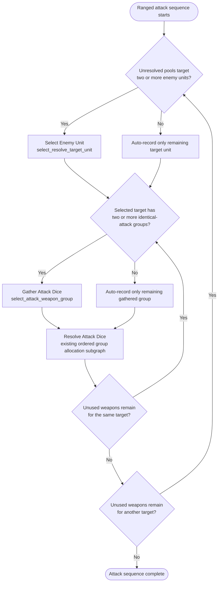

# Attack Sequence Ordered Group Allocation

This document summarizes the CORE V2 ranged attack sequence. Phase 14L adds the
rulebook Select Enemy Unit and Gather Attack Dice layer before the existing
ordered group allocation resolver. The gathered attack group then feeds the same
engine-owned hit, wound, allocation, save, damage, mortal-wound, and destruction
reaction path shown in the second diagram.

The Gather Attack Dice step groups unresolved ranged pools for the selected
target only when their deterministic identical-attack signature matches. The
signature includes hit basis, hit/wound modifiers, Strength, AP, Damage,
applicable structured weapon abilities/keywords, targeting rule IDs, shooting
type, attacker model ID, wargear/profile IDs, visible and in-range target model
IDs, and optional Firing Deck source unit/model IDs. These provenance fields are
part of the signature because the current resolver turns a gathered group into a
single synthetic `RangedAttackPool`; the copied pool identity must therefore be
identical across every contribution before hit/wound attribution, Precision
visibility, cover/LOS, save, damage, event attribution, or Firing Deck/source
attribution can run through that synthetic pool. It deliberately excludes only
the Attacks count and raw weapon range value; per-contribution attack counts
remain replay evidence in the gathered group payload. Melee attack splitting and
melee identical-attack gathering remain Phase 15 Fight-phase work.

The following diagram is the Resolve Attack Dice subgraph for one gathered group.
Normal damage and mortal wounds share the same engine-owned decision/replay path,
but normal damage walks sorted save dice through ordered allocation groups before
resolving model damage. Mortal wounds bypass saving throws and route directly to
mortal-wound allocation and model damage resolution.

Key constraints:

- The engine owns every mutation after `DecisionResult` validation.
- Allocation order is a finite engine-emitted decision only when multiple legal
  same-tier group orders exist.
- Normal damage rolls all pooled saving throw dice before applying normal
  damage, then resolves save events while walking the sorted dice. A real armour
  or invulnerable save with a target above 6 remains a saving throw; an effect
  that permits no saving throw may use an internal
  `attack_sequence.allocation_order.no_save` die only for deterministic ordering.
- Normal damage stays on the current model until that model is destroyed. If
  the current ordered group still has eligible models, allocation shifts to the
  next model in that group; it advances to the next ordered group only after
  the current group is exhausted.
- Feel No Pain is resolved, declined, or auto-applied at the lost-wound stage
  before any remaining damage is applied to the model.
- Destruction windows are opened only after damage leaves a model destroyed.
  Mandatory destruction reactions such as Deadly Demise resolve before removal
  and can recursively route mortal wounds that destroy additional models with
  their own mandatory destruction reactions. Optional destruction reactions are
  then emitted through the lifecycle decision path when the rules provide a
  choice.
- Mortal wounds do not create save choices; optional Feel No Pain and
  destruction reactions still use the same lifecycle decision path.
