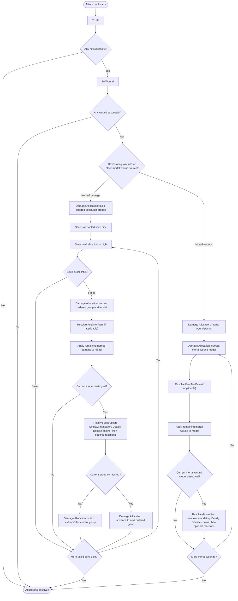

# Attack Sequence Ordered Group Allocation

This diagram summarizes the CORE V2 pooled attack sequence for ordered group
allocation. Normal damage and mortal wounds share the same engine-owned
decision/replay path, but normal damage walks sorted save dice through ordered
allocation groups before resolving model damage. Mortal wounds bypass saving
throws and route directly to mortal-wound allocation and model damage
resolution.

Key constraints:

- The engine owns every mutation after `DecisionResult` validation.
- Allocation order is a finite engine-emitted decision only when multiple legal
  same-tier group orders exist.
- Normal damage rolls all pooled saving throw dice before applying normal
  damage, then resolves save events while walking the sorted dice. A real armour
  or invulnerable save with a target above 6 remains a saving throw; an effect
  that permits no saving throw may use an internal
  `attack_sequence.allocation_order.no_save` die only for deterministic ordering.
- Normal damage stays on the current model until that model is destroyed. If
  the current ordered group still has eligible models, allocation shifts to the
  next model in that group; it advances to the next ordered group only after
  the current group is exhausted.
- Feel No Pain is resolved, declined, or auto-applied at the lost-wound stage
  before any remaining damage is applied to the model.
- Destruction windows are opened only after damage leaves a model destroyed.
  Mandatory destruction reactions such as Deadly Demise resolve before removal
  and can recursively route mortal wounds that destroy additional models with
  their own mandatory destruction reactions. Optional destruction reactions are
  then emitted through the lifecycle decision path when the rules provide a
  choice.
- Mortal wounds do not create save choices; optional Feel No Pain and
  destruction reactions still use the same lifecycle decision path.
